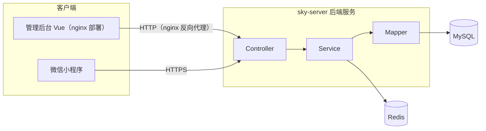

[README.md](https://github.com/user-attachments/files/32693391/README.md)
# 苍穹外卖 Sky Take Out


> 为餐饮企业（单体门店）定制的外卖点餐系统，包含 **系统管理后台（PC 端）** 与 **用户端（微信小程序）**，基于 Spring Boot + MySQL + Redis，覆盖菜品管理、在线点餐、下单支付、订单调度、数据统计的完整业务闭环。

## 一、项目简介

本项目采用前后端分离架构开发：

- **管理端（PC）**：供餐饮企业内部员工使用，对员工、分类、菜品、套餐、订单、店铺状态、运营数据进行统一管理维护。
- **用户端（微信小程序）**：供消费者使用，支持微信授权登录、浏览菜品与套餐、购物车、在线下单与支付、催单等。

## 二、架构总览



## 三、技术选型

### 后端

| 分类 | 技术 |
| --- | --- |
| 基础框架 | Spring Boot 2.7.3、Spring MVC |
| 持久层 | MyBatis、PageHelper（分页插件） |
| 数据库 | MySQL 8.0 |
| 缓存 | Redis、Spring Data Redis、Spring Cache |
| 认证授权 | JWT（jjwt）、拦截器 |
| 任务调度 | Spring Task（订单状态定时处理） |
| 服务端推送 | WebSocket（来单提醒、催单提醒） |
| 文件存储 | 阿里云 OSS |
| 报表导出 | Apache POI |
| 远程调用 | HttpClient |
| 接口文档 | Knife4j（Swagger） |

### 前端与工具

| 分类 | 技术 |
| --- | --- |
| 管理后台 | Vue + Element Plus（nginx 部署） |
| 用户端 | 微信小程序（原生开发） |
| 构建工具 | Maven（多模块聚合工程） |
| 辅助工具 | nginx、Git、Postman / Apifox、微信开发者工具、IDEA |

## 四、项目结构

```text
sky-take-out
├── sky-common                        # 公共模块：工具类、常量、统一返回结果、全局异常、JWT 配置等
├── sky-pojo                          # 实体模块：Entity（实体）/ DTO（传输对象）/ VO（视图对象）
├── sky-server                        # 服务端模块：Controller / Service / Mapper（唯一可运行模块）
├── nginx-1.20.2                      # 管理后台前端，nginx 部署并反向代理后端接口
├── sky-take-out-WecharMiniProgram    # 用户端微信小程序源码
└── pom.xml                           # 父工程，聚合管理各子模块
```

## 五、功能模块

### 管理端

| 模块 | 功能点 | 关键技术 |
| --- | --- | --- |
| 登录 / 退出 | 账号密码登录、JWT 令牌校验、退出 | JWT + 拦截器 |
| 员工管理 | 新增员工、分页查询、启用 / 禁用账号、编辑、修改密码 | ThreadLocal 公共字段自动填充 |
| 分类管理 | 新增、分页查询、修改、删除、按类型查询 | — |
| 菜品管理 | 新增（含口味）、分页查询、修改、起售 / 停售、批量删除 | 阿里云 OSS 文件上传 |
| 套餐管理 | 新增、分页查询、修改、起售 / 停售、批量删除 | Spring Cache + Redis 缓存 |
| 工作台 | 今日数据、待处理订单快捷入口 | — |
| 订单管理 | 分页查询、订单详情、接单 / 拒单、派送、完成 | WebSocket 来单提醒 |
| 店铺状态 | 营业中 / 打烊切换 | Redis 存储状态 |
| 数据统计 | 营业额 / 用户 / 订单统计、销量 Top10、Excel 导出 | Apache POI |

### 用户端（微信小程序）

| 模块 | 功能点 | 关键技术 |
| --- | --- | --- |
| 登录 | 微信授权登录 | HttpClient + JWT |
| 菜品浏览 | 分类查询、菜品 / 套餐详情、口味展示 | Redis 缓存 |
| 购物车 | 添加 / 减少、查看、清空 | — |
| 下单支付 | 提交订单、微信支付 | 微信支付 API |
| 订单中心 | 历史订单、订单详情、再来一单、催单、取消订单 | Spring Task 超时处理 |
| 地址簿 | 新增、编辑、删除、设为默认地址 | — |

## 六、数据库设计

业务数据库 `sky`，共 11 张表：

| 表名 | 说明 |
| --- | --- |
| employee | 员工表 |
| category | 分类表（菜品分类 / 套餐分类） |
| dish | 菜品表 |
| dish_flavor | 菜品口味表 |
| setmeal | 套餐表 |
| setmeal_dish | 套餐与菜品关联表 |
| user | 用户表（用户端） |
| address_book | 地址簿表 |
| shopping_cart | 购物车表 |
| orders | 订单表 |
| order_detail | 订单明细表 |

## 七、核心技术亮点

1. **双端 JWT 认证**：管理端与用户端使用独立 Token，分别由拦截器统一校验；
2. **公共字段自动填充**：自定义注解 + AOP + ThreadLocal，自动填充创建 / 更新时间、创建 / 更新人；
3. **全局异常处理 + 统一响应封装**：Result 对象统一返回格式，异常统一兜底；
4. **Redis 多场景应用**：店铺营业状态、菜品 / 套餐缓存，并处理缓存与数据库的一致性；
5. **WebSocket 主动推送**：来单提醒、用户催单实时通知管理端；
6. **Spring Task 订单状态管理**：支付超时订单自动取消、派送超时订单自动完成；
7. **HttpClient 远程调用**：对接微信接口服务（登录、支付）；
8. **Apache POI 报表**：运营数据统计并导出 Excel。

## 八、快速启动

### 环境要求

| 环境 | 版本要求 |
| --- | --- |
| JDK | 8 及以上 |
| MySQL | 8.0 |
| Redis | 5.0 及以上 |
| Maven | 3.6 及以上 |
| nginx | 1.20.2 |
| 微信开发者工具 | 最新稳定版 |

### 启动步骤

1. 克隆仓库

   ```bash
   git clone https://github.com/queen-F661/sky-take-out.git
   ```

2. 创建数据库 `sky`，导入项目配套的数据库脚本（表结构 + 测试数据）；

3. 修改 `sky-server/src/main/resources/application-dev.yml` 中的 MySQL、Redis、阿里云 OSS、微信小程序 AppID 等配置；

4. 启动后端：运行 `sky-server` 模块下的 `SkyApplication`；

5. 启动管理端：运行 nginx，浏览器访问 <http://localhost:80>，默认管理员账号 `admin / 123456`；

6. 启动用户端：微信开发者工具导入 `sky-take-out-WecharMiniProgram`，填入自己的小程序 AppID。

### 接口文档

后端启动后访问 Knife4j 在线文档：<http://localhost:8080/doc.html>

## 九、声明

- 本项目基于 **黑马程序员《苍穹外卖》实战课程** 学习实现，仅用于个人学习与技术交流，请勿用于商业用途。
- 感谢黑马程序员提供的优质课程资源。
